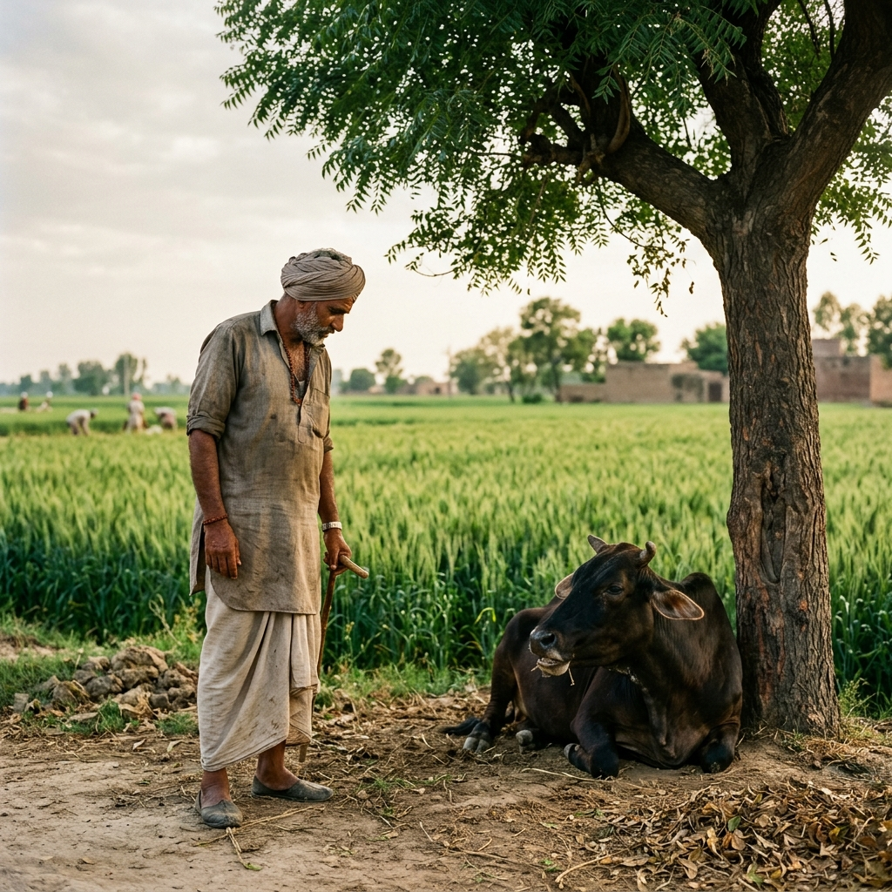

# The Accountability Manifesto: Restoring the Natural Balance

### A Policy Proposal for India's 2,64,000 Villages and 8,000 Towns

---

> *"I don't want to hurt the cow. But if I don't chase it away, my family doesn't eat tonight."*
>
> — A farmer from rural India

This is not a story about cruel people. This is a story about a system that has left both humans and animals with no choice but to fight each other for survival. This manifesto proposes a simple, practical solution: **give a tiny fraction of our land back to the animals**, and in return, we get cleaner air, cooler streets, and an end to the conflict that neither side ever wanted.

---

## Part I: The Crisis — In Numbers

### The Vanishing Habitat

Between April 2021 and March 2025, the Central Government approved the diversion of **78,136 hectares** of forest land for non-forest use — highways, railways, mining, and urban expansion. In just the first six months of 2025, another **12,324 hectares** were approved. In total, across the five financial years from 2020-21 to 2024-25, over **92,000 hectares** of forest land were cleared across **6,188 separate proposals**.

> **Source:** Ministry of Environment, Forest and Climate Change (via Sansad response, 2025)

Every hectare that disappears is someone's home — not a human's, but a jackal's, a fox's, a deer's, a rabbit's. And when that home is destroyed, the animal doesn't simply vanish. It walks into our villages, our fields, and our streets.

### The Animals We Abandoned

India's 21st Livestock Census (October 2024 — March 2025) is still being processed, but existing estimates paint a stark picture:

| Crisis | Scale |
|--------|-------|
| **Stray dogs** | 15.3 million to 52.5 million (Dept. of Animal Husbandry / independent estimates) |
| **Stray cattle** | Over 5 million abandoned cows and bulls, rising as dairy farms discard unproductive animals |
| **Dog bites** | 3.7 million cases reported in 2024 alone |
| **Chhattisgarh** | Stray cattle population surged by 33.93% in a single census period |

These are not wild animals invading civilization. **These are animals we used, abandoned, and left to die on our roads.**

### The Farmer's Impossible Choice

We spoke to farmers across rural India. Not a single one of them wanted to harm animals. But every one of them described the same impossible situation:

> A herd of stray cattle enters the wheat field at night. A pack of nilgai tramples the soybean crop. Wild boars dig up the potato harvest. The farmer has invested everything — seeds, fertilizer, months of labour, borrowed money — into that field. And now, within a single night, **30 to 40 percent of it is gone**.

What does the farmer do? He shouts. He chases. Sometimes, in desperation, he beats the animals away. Not because he is cruel. **Because his children's school fees depend on that harvest.** Because he borrowed ₹50,000 from a money-lender to plant that crop.

The data confirms this:

- In **Maharashtra alone**, annual agricultural losses from animal raids are estimated between **₹10,000 crore and ₹40,000 crore**
- Regions like Himachal Pradesh, Uttar Pradesh, and Chhattisgarh report devastating crop damage from stray cattle, nilgai, wild boar, and monkeys
- Until late 2025, crop insurance (PMFBY) did **not even recognize** wild animal damage as a covered risk. It is only from Kharif 2026 that "wild animal attacks" will be added as a "Localised Risk" add-on cover

For decades, we have treated this as the farmer's problem. **It is not.** It is a systemic failure. The animals have nowhere to go because we took their land. The farmer suffers because the animals have no alternative food source. Both sides are victims.

### The Boiling Nation

While animals starve on the streets and farmers guard their fields at night, our cities and villages are literally cooking:

- 🌡️ Indian cities are warming **45% to 60% faster** than surrounding rural areas due to the Urban Heat Island effect
- 🔥 In 2025, "feels-like" temperatures in Delhi reached **52°C**. **76% of Delhi** is now classified as "persistently heat-stressed"
- 🌙 **30 of India's 100 Smart Cities** experienced nighttime heatwaves between 2001 and 2024 — meaning cities no longer cool down even at night
- 📈 Tier-II cities like Patiala, Hisar, and Jalandhar are projected to warm **twice as fast** as their surrounding rural areas
- 🏗️ The primary cause: loss of green cover, loss of water bodies, and the replacement of natural surfaces with heat-absorbing concrete and asphalt

And in this heat, where do stray animals go for shade? **Nowhere.** Because we paved over every tree they used to sleep under.

---

## Part II: The Solution — The Coexistence Mandate

### Policy: The 2-Acre Micro-Sanctuary Rule

India has **2,64,211 Gram Panchayats** and over **8,000 urban municipalities**. We propose one simple mandate:

> **Every Gram Panchayat and every municipal ward must establish and maintain one Micro-Sanctuary — a minimum 2-acre plot of densely forested land with a water body, dedicated exclusively to local animals and ecological restoration.**

This is not a national park. This is not a wildlife reserve. This is a small, local, community-managed green space — a dedicated place where the stray cow can graze, the dog can find shade, and the jackal can drink water without wandering into someone's farm.

---

## The Five Pillars of the Micro-Sanctuary

---

### 🌳 Pillar 1: Habitat — A Zoned Sanctuary, Not Just a Forest

A micro-sanctuary is **not** a wall-to-wall plantation. It is a carefully zoned habitat with distinct areas for forest, grazing, water, and animal shelter. Every 2 acres (8,094 sq m) must be divided as follows:

**Mandatory Zoning Layout:**

| Zone | % of Area | Size | Purpose |
|------|-----------|------|---------|
| 🌳 **Dense Forest** (Miyawaki) | ~50% | ~4,050 sq m (1 acre) | Shade, oxygen, cooling, biodiversity, animal cover |
| 🌾 **Open Grazing Meadow** | ~25% | ~2,025 sq m (0.5 acre) | Fodder grasses for cattle, nilgai, and herbivores |
| 💧 **Water Body** (pond/tank) | ~8% | ~650 sq m (approx. 25m × 26m) | Drinking water for all animals, minimum 3m depth |
| 🐾 **Animal Resting Area** | ~10% | ~810 sq m | Soft ground, shade structures, sheltered spots for dogs and small animals |
| 🛤️ **Paths & Feeding Stations** | ~7% | ~560 sq m | Access paths, salt lick stations, feeding points, basic veterinary shed |

**Forest Zone — Planting Standards (applied to the ~1 acre forest zone only):**

The Miyawaki method plants **3 to 5 saplings per square metre**. At standard density, 1 acre of Miyawaki forest can hold **12,000 to 20,000 plants**. Our minimum requirement is far more conservative — ensuring healthy growth with space between clusters:

- ✅ **3,000 native saplings per acre** of forest zone (mix of trees and shrubs), planted at ~3 saplings per sq m
- ✅ This includes a mix of **canopy trees** (neem, peepal, banyan, mango), **sub-canopy trees** (jamun, amaltas, gulmohar), **shrubs** (karonda, henna, lantana alternatives), and **ground cover**
- ✅ **Multi-layer planting** — 4 layers (canopy, sub-canopy, shrub, ground cover) to mimic natural forest structure
- ✅ A minimum **60% canopy cover** over the forest zone must be achieved within 5 years, verified by satellite imagery through ISRO's BHUVAN platform
- ✅ All species must be **native to the local bioregion** — no ornamental or invasive species

> **Why Miyawaki?** Research from IIT Kanpur confirms that Miyawaki forests reduce local temperatures by a minimum of **2°C**, absorb up to **15%** of airborne microparticles (dust), reduce noise by approximately **10 dB**, and support biodiversity levels **18 times higher** than conventional plantations. They mature in **3-5 years** instead of decades.

> **Why not plant the entire 2 acres as forest?** Because animals need open space too. Cattle graze on meadows, not in dense forest. Dogs need open resting areas. The water body needs an unshaded perimeter so animals can access it easily. The zoning ensures every species — from a stray cow to a nesting bird — finds the habitat it needs.

**What This Means at National Scale:**

If deployed across all 2,64,000 Gram Panchayats alone (excluding urban wards):

| Metric | Scale |
|--------|-------|
| **New dense forest** | 2,64,000 acres (~1,07,000 hectares) of Miyawaki forest |
| **Open grazing meadows** | 1,32,000 acres of managed grassland |
| **Water bodies** | 2,64,000 new ponds across India |
| **Native saplings planted** | Over **790 million** (3,000 per sanctuary) |
| **Coverage** | Every inhabited corner of India |

For context: the government diverted 92,000 hectares of forest in 5 years. **This policy would create over 1,07,000 hectares of new dense forest plus 53,000 hectares of grazing meadows** — distributed exactly where it is needed most.

---

### 💧 Pillar 2: Water — Guarantee Drinking Water for Animals Year-Round

Each micro-sanctuary must feature a dedicated water body — a pond, a rejuvenated well, or a constructed tank.

**Specifications:**

- 💧 **Minimum 3-metre depth** to survive peak summer evaporation (May-June)
- 🌧️ **Rainwater harvesting infrastructure** to recharge the water body naturally
- ⚡ **Zero dependence on electricity.** Water must be accessible using gravity-fed systems, manual pumps, or wind-driven mechanisms — ensuring continuous operation even during power cuts and grid failures
- 🏜️ In arid zones (annual rainfall below 400mm), underground water tanks (*tankas*) shall replace open ponds, following traditional Rajasthani design

> **Why No Electricity?** Because power failures are common in rural India, and animals need water most during peak summer — exactly when power cuts are longest. A gravity-fed pond or a traditional hand-pump works 365 days a year, regardless of the grid. Zero carbon emissions. Zero maintenance cost. Infinite reliability.

---

### 🌾 Pillar 3: Attraction — Make the Sanctuary Better Than the Farm

> **This is the most critical pillar.** A sanctuary only works if animals *prefer* it over raiding a farmer's field. Planting trees alone is not enough. The sanctuary must actively attract animals.

**Each micro-sanctuary must include:**

- 🌿 **Dedicated grazing patches** with high-nutrition fodder grasses — napier grass, guinea grass, berseem — that are more nutritious and palatable than field crops
- 🧂 **Salt licks and mineral blocks** to attract herbivores and encourage repeat visits
- 🐕 **Shaded resting areas** with soft ground (not concrete) for stray dogs and cattle
- 🍽️ **Community-managed feeding stations**, operated daily, funded via the mechanisms described in the Funding section below

**Transition Period (First 3 Years):**

During the initial years while the forest matures, mobile fodder distribution at sanctuary sites will train animal movement patterns. Animals are creatures of habit — once they learn that the sanctuary provides reliable food and water, they will stop wandering into farms. This is not theory. **Gaushalas (cow shelters) across India already demonstrate this principle:** cattle return to where they are fed.

**This is how you solve the farmer's problem.** Not by building a fence. Not by punishing the farmer. Not by relocating the animal. **By giving the animal a better alternative.**

---

### 🏗️ Pillar 4: Land — Where Does the 2 Acres Come From?

#### The Question Everyone Will Ask: *Who gives up the land?*

This is the hardest part of any land-based policy in India. We address it head-on.

**Land Sourcing — Strict Priority Order:**

**1. Government Wasteland First**

Every Gram Panchayat has designated "wasteland" or "banjar" land — barren, unused plots that generate no revenue. These must be surveyed first.

**2. Revenue Land Currently Lying Fallow**

State revenue departments maintain records of fallow land. Plots that have been unproductive for 5+ years are ideal candidates.

**3. Voluntary Farmer Participation with Fair Compensation**

Farmers across India have willingly sold land for national highways, railways, and infrastructure projects when offered fair prices. The same principle applies here.

Under the **Right to Fair Compensation and Transparency in Land Acquisition, Rehabilitation and Resettlement Act (RFCTLARR), 2013**:

| Component | What the Farmer Gets |
|-----------|---------------------|
| **Market Value** | Highest of: circle rate, average sale price of similar land over preceding 3 years, or consented amount |
| **Multiplication Factor** | 1.0x to 2.0x applied in rural areas to account for livelihood loss |
| **Solatium** | 100% of the total calculated value added — effectively doubling the compensation |
| **Interest** | 12% annual interest from date of notification until payment |

**This means:** a farmer selling 2 acres for a micro-sanctuary would receive approximately **2x to 4x the market value** of the land — the same terms used for highway acquisition. Many farmers, especially those with unproductive or marginal plots, would consider this a good deal.

**4. Voluntary Donation with Tax Benefits**

Landowners who donate land for micro-sanctuaries shall receive full exemption under Section 80G of the Income Tax Act and permanent property tax exemption on remaining holdings in the same village.

---

> ⚠️ **ABSOLUTE PROTECTION FOR ACTIVE FARMLAND**
>
> No agricultural land currently under active cultivation shall be acquired without the written, voluntary consent of the farmer. No farmer shall be forced to give up productive land. **This policy exists to help farmers, not hurt them.**

---

**Site Selection — Transparent and Accountable:**

To prevent political misuse, every site must be selected by a committee consisting of:

1. The **District Forest Officer**
2. The elected **Sarpanch or Ward Councillor**
3. **Two nominated community members** (rotating annually)
4. An **independent ecologist** from a registered institution or university

All site selections must be published in the local newspaper and on the district government website with a **30-day public objection period**. No private land may be selected without the landowner's written consent.

---

### 🔧 Pillar 5: Maintenance — Because Planting Trees Is Only Day One

India has planted billions of trees in various government drives. The survival rate is often **below 40%**. Why? Because nobody waters them after the photo-op. This policy mandates a **5-year minimum maintenance commitment**.

**Every micro-sanctuary must have:**

- 👤 **A Designated Caretaker:** A local resident employed under MNREGA (Mahatma Gandhi National Rural Employment Guarantee Act), receiving a monthly stipend for daily maintenance — watering, clearing debris, managing the feeding station, and monitoring animal welfare

- 💰 **A 5-Year Maintenance Budget:** Ring-fenced funds that cannot be diverted, covering saplings replacement, water body upkeep, fodder supply, and basic veterinary supplies

- 📊 **Annual Survival Audit:** If tree survival falls below 70% in any given year, mandatory replacement planting must occur in the following monsoon season. Satellite verification through BHUVAN.

- 🌊 **Water Body Monitoring:** The water body must hold water through the peak summer months (April-June). If it dries up, the Gram Panchayat must arrange emergency water tanker supply until the next monsoon recharges it.

- 👥 **Community Ownership:** Each sanctuary shall have a "Sanctuary Committee" of 5 local residents (including at least 2 women), responsible for day-to-day oversight, conflict resolution, and reporting to the Block Development Officer.

---

## Part III: Special Provisions — Because India Is Not One-Size-Fits-All

### Provision A: The Jungle Exemption

If a Gram Panchayat falls within a **5-kilometre radius** of a designated Reserved Forest, National Park, or Wildlife Sanctuary (as defined under the Wildlife Protection Act, 1972) with verified canopy density of at least **40%** (per Forest Survey of India data), the 2-acre plantation requirement is waived.

> **However:** The water body and feeding station requirements still apply. Because stray domestic animals (cattle, dogs) do not migrate to forests — they need local support regardless.

### Provision B: Desert and Arid Regions

In regions with annual rainfall below 400mm (Thar Desert, Kutch, Ladakh, parts of Rajasthan):

- 🌵 Xeriscaping with drought-resistant native species: *khejri, babool, rohida, ker, phog*
- 🏺 Underground water tanks (*tankas*) instead of open ponds
- 🌱 Minimum tree density reduced to **150 per acre**, with emphasis on shrubs, cacti, and ground cover
- 🚛 Supplementary water supplied via tanker until rainwater harvesting becomes self-sustaining

### Provision C: Flood-Prone Areas

In regions prone to annual flooding (Bihar, Assam, Bengal, Eastern UP):

- 🏔️ Micro-sanctuaries must be located on **elevated ground** — natural ridges or constructed earthen bunds
- 🌳 Tree species must be flood-tolerant: *jamun, arjun, kadam, hijal*
- 🏠 **Raised animal shelters** (elevated platforms with roofing) must be provided for monsoon months

### Provision D: Urban Alternatives

In Tier-1 cities (population above 10 lakh) where 2 acres of contiguous land is prohibitively expensive:

- 🏚️ Convert existing abandoned plots, dried lake beds, or disused railway/military land
- 🏢 **Mandatory green zone clause:** all new real estate developments over 5 acres must designate 2% of total area as animal-accessible green space
- 🌿 Rooftop gardens on government buildings (minimum 5,000 sq ft per ward) for bird habitat
- 🐾 The animal welfare components (water stations, shaded shelters, feeding points) must be implemented **regardless** of whether full tree plantation is feasible

### Provision E: Predator Safety

In areas with documented presence of large predators (leopards, wolves, hyenas):

- 🔒 Perimeter fencing designed for the specific species threat
- ⚠️ Warning signage and community awareness programs
- 🤝 Coordination with local Forest Department for predator management
- 🏫 Sanctuaries must not be located adjacent to schools, hospitals, or children's play areas — **minimum 200-metre buffer**

---

## Part IV: Funding — Where Does the Money Come From?

**This policy does not require new taxes. The money already exists.**

### 1. CAMPA Fund (Compensatory Afforestation Fund)

| Detail | Figure |
|--------|--------|
| Funds transferred to 34 States/UTs (as of 2025) | **₹84,556 crore** |
| Compensatory afforestation undertaken (2020-25) | Only 3.20 lakh hectares |
| Estimated cost per rural sanctuary | **₹8-15 lakh** |
| Total cost for 2,64,000 rural sanctuaries | **₹2,100 — 3,960 crore** |
| % of available CAMPA funds required | **Less than 5%** |

The funds are massively underutilized. Micro-sanctuaries are a legally valid use under the Compensatory Afforestation Fund Act, 2016.

### 2. MNREGA (Mahatma Gandhi National Rural Employment Guarantee Act)

- Plantation, pond digging, bund construction, and maintenance are all **eligible MNREGA activities**
- The caretaker salary is paid through MNREGA
- This creates **guaranteed rural employment** while building ecological infrastructure

### 3. Non-Profit Organizations — India's Animal Welfare Network

India has one of the world's most active animal welfare ecosystems. These organizations can co-fund, co-manage, and provide expertise:

| Organization | Role in Micro-Sanctuaries |
|-------------|--------------------------|
| **People for Animals (PFA)** | India's largest animal welfare org — veterinary support for sanctuary animals |
| **PETA India** | Advocacy, campaigns, rapid-response rescue, corporate partnerships |
| **Blue Cross of India** | Pioneers of Animal Birth Control (ABC) — sterilization/vaccination drives |
| **Animal Aid Unlimited** (Udaipur) | Emergency rescue, street animal care — model for management training |
| **STRAW India** | Humane education — school programs about local sanctuaries |
| **Local NGOs** (RESQ, CARE, Kannan, SGACC) | Hundreds of regional organizations can adopt specific sanctuaries |

The **Animal Welfare Board of India (AWBI)** maintains a national registry of recognized organizations. Each micro-sanctuary can be linked with a registered NPO for:

- 🏥 Veterinary camps (twice yearly)
- 💉 Animal Birth Control drives (sterilization + vaccination)
- 🚑 Emergency rescue coordination
- 🤝 Volunteer management and community engagement

### 4. Corporate Social Responsibility (CSR)

- Companies with operations in the area can adopt sanctuaries under their **mandatory 2% CSR spending** (Companies Act, 2013)
- Environmental restoration and animal welfare are both eligible CSR activities

### 5. Voluntary Builder & Homeowner Contributions (Not a Tax — A Choice)

This is **not** a mandatory cess. It is an invitation.

When people are forced to pay, they pay the minimum and resent it. When people are **given the choice** to contribute to a cause they can see, touch, and walk through — many of them give far more than any tax would have collected.

- 🏠 Every new construction project within 2 km of a micro-sanctuary will be **invited** (not mandated) to contribute to its maintenance fund
- 💡 **Suggested contribution:** ₹1 per square foot — for a 1,000 sq ft home, that's just ₹1,000
- 🏆 Contributors get a **named plaque** at the sanctuary: *"This tree was planted with the support of [Name/Family]"*
- 🌳 Larger donors (₹10,000+) can **name a section** of the sanctuary — "The [Family Name] Grove" or "The [Company] Meadow"
- 📜 All contributions qualify for **80G tax deduction**

> **The psychology is simple:** A ₹1/sq ft tax collects ₹1,000 from every builder and generates resentment. A voluntary invitation with recognition collects ₹1,000 from most builders, ₹10,000 from some, and ₹1,00,000 from a few — and generates pride. **Free will always outperforms compulsion when the cause is visible and local.**

### 6. Voluntary Contributions

- All donations to micro-sanctuary trusts shall qualify for **80G tax deduction**
- Online donation portals linked to specific sanctuaries for transparency

---

## Part V: Implementation Timeline

### Phase 1 — Foundation (Months 1-12)

- 📋 National survey of available government wasteland by each Gram Panchayat
- 📍 Site identification and committee formation
- 🤝 NPO partnerships established via AWBI coordination
- 💰 CAMPA fund allocation by State Forest Departments
- 🧪 Pilot program in **500 Panchayats across 10 states**

### Phase 2 — Plantation (Months 12-36)

- 🌳 Miyawaki plantation across all identified sites during monsoon seasons
- 💧 Water body construction (ponds, tankas, wells)
- 🌾 Feeding station setup and fodder grass seeding
- 👷 MNREGA caretaker appointments
- 💉 First Animal Birth Control drives at sanctuary sites

### Phase 3 — Growth and Adaptation (Months 36-60)

- 🌿 Canopy development and forest maturation
- 🛰️ Monitoring via BHUVAN satellite imagery
- 📊 Annual survival audits and replacement planting
- 🐄 Animal movement pattern stabilization (reduced farm raids)
- 🏫 Community engagement programs in schools and Panchayat meetings

### Phase 4 — Self-Sustaining Operation (Month 60+)

- 🌲 Mature forests operating as self-sustaining ecosystems
- 🌧️ Water bodies recharged naturally through rainwater harvesting
- 📉 Reduced maintenance costs as forests become self-propagating
- 📋 Annual ecological audits
- 🏙️ Expansion to remaining Panchayats and urban wards

---

## Part VI: How We Measure Success

**Every policy must be measurable. No vague promises. Hard numbers. Annual public reporting.**

### For Animal Welfare

| Metric | Target |
|--------|--------|
| Farmer-animal conflict complaints | **50% reduction** within 3 years |
| Stray animal road deaths (within 2 km) | **40% reduction** |
| Dog bite incidents | **30% reduction** (less stressed, better fed animals) |
| Animal census at sanctuary sites | Conducted annually |

### For Environment

| Metric | Target |
|--------|--------|
| Tree survival rate | **Above 70%** per year |
| Canopy cover | **60%** within 5 years (satellite-verified) |
| Local temperature (sanctuary vs. control) | **Minimum 2°C cooler** |
| PM2.5 reduction (within 500m radius) | **10-15% improvement** |
| Water body status | **Must hold water through May-June** |

### For Farmers

| Metric | Method |
|--------|--------|
| Crop damage incidents | Logged by Panchayat secretary |
| Farmer satisfaction | Annual anonymous surveys |
| Crop insurance claims | Comparison: sanctuary vs. non-sanctuary areas |

### For Governance

| Metric | Mechanism |
|--------|-----------|
| Progress reporting | District Collector submits quarterly reports to State government |
| Transparency | Reports made publicly available on district website |
| Accountability | Districts failing to comply within 24 months → **non-agricultural land conversion permissions suspended** |

---

## Part VII: Why This Matters — The Bigger Picture

### What We Get If We Do This

**1. For Animals** — A guaranteed home. Shade in the summer. Water when they are thirsty. Food when they are hungry. A life where survival doesn't require invading someone else's territory. Stray dogs will have shaded ground to rest on instead of burning asphalt. Abandoned cattle will have grass to eat instead of garbage dumps. Jackals and foxes will have forest to retreat to instead of our backyards.

**2. For Farmers** — An end to the nightly battle. When the cow has a sanctuary with better fodder 500 metres away, she won't walk 2 kilometres to eat your wheat. When the nilgai has forest to browse in, it won't trample your soybean. This policy doesn't just protect animals — **it protects farmers' livelihoods, their sleep, and their mental health.**

**3. For Our Air** — 790 million native saplings breathing oxygen into 2,64,000 communities. Thick canopies trapping dust, PM2.5, and pollutants. Natural air purifiers running 24/7, free of charge, for generations.

**4. For Our Heat** — Dense 2-acre Miyawaki forests acting as "green air conditioners" in every village and neighbourhood. Research shows at least **2°C local cooling**. In a nation where cities hit 52°C and nighttime temperatures refuse to drop, even 2 degrees can be the difference between life and death — for humans and animals alike.

**5. For Our Communities** — Instead of endless gray concrete and barren dust bowls, every Panchayat will have a lush, green, thriving landscape. A place where children can see birds. Where old people can sit in shade. Where the air smells of earth instead of exhaust.

---

## The Math That Matters

| What | How Much |
|------|----------|
| **What it costs** | ₹2,100 — 3,960 crore (from existing CAMPA funds — less than 5% of what's available) |
| **What it creates** | 1,07,000 hectares of new dense forest + 53,000 hectares of grazing meadows + 2,64,000 new ponds |
| **What it plants** | 790 million native saplings |
| **What it protects** | 5 million+ stray cattle, 15-52 million stray dogs, and countless wild animals |
| **What it saves** | ₹10,000 — 40,000 crore in annual crop losses from animal raids (in Maharashtra alone) |

**This is not expensive. This is not impractical. This is the cheapest, most effective policy India can implement for its animals, its farmers, its air, and its future.**

---

## A Final Word

We did not write this manifesto to blame anyone. The farmer who chases the cow is not the villain. The municipality that paved over the park is not the villain. The highway that split the forest is not the villain.

**The villain is the absence of a plan.**

Animals and humans have coexisted on this land for thousands of years. It is only in the last few decades — as we built more, paved more, and took more — that we broke the balance. This policy doesn't ask us to stop building. It doesn't ask us to stop growing. It asks us to give back just 2 acres out of every few thousand — a tiny fraction, barely visible on a map — so that every creature in this country has at least one small place to call home.

> That farmer who told us, *"I don't want to hurt the cow"* — he deserves a system where he doesn't have to.
>
> That cow deserves a system where she doesn't have to beg for food on a burning road.
>
> **This is that system.**

---

## Data Sources and References

1. **Forest Land Diversion:** Ministry of Environment, Forest and Climate Change; Sansad (Parliament) response, 2025 — 78,136 hectares (2021-25), 92,063 hectares (2020-25)
2. **CAMPA Fund:** ₹84,556 crore transferred to States/UTs as of 2025 (Sansad response)
3. **Stray Dog Population:** Department of Animal Husbandry — 15.3 million; independent estimates up to 52.5 million
4. **Stray Cattle:** Estimated 5+ million (IndiaDataMap, Pashudhan Praharee)
5. **Dog Bites:** 3.7 million cases in 2024 (PMFIAS, ForumIAS)
6. **21st Livestock Census:** October 2024 — March 2025 (DAHD, PIB)
7. **Urban Heat Island:** Cities warming 45-60% faster (Global Climate Risks, The Hindu, 2025)
8. **Delhi Heat Stress:** 76% persistently heat-stressed, feels-like 52°C (Down to Earth, 2026)
9. **Nighttime Heatwaves:** 30 of 100 Smart Cities affected (Mongabay, 2025)
10. **Miyawaki Method:** IIT Kanpur — minimum 2°C cooling, 15% dust reduction, 18x biodiversity (IIT Kanpur research)
11. **Crop Insurance:** PMFBY updated for Kharif 2026 to include wild animal damage as "Localised Risk"
12. **Land Acquisition:** RFCTLARR Act, 2013 — market value + multiplier + 100% solatium (PIB, Sansad)
13. **Gram Panchayats:** 2,64,211 (Ministry of Panchayati Raj, 2025-26)
14. **Animal Welfare Organizations:** Animal Welfare Board of India (AWBI) registry
15. **MNREGA:** Plantation, pond construction, and land development are eligible activities
16. **Maharashtra Crop Loss:** ₹10,000 - 40,000 crore estimated annual agricultural losses from wildlife conflict

---

## SEO-Optimized Headlines (Choose One for Publication)

> **Option 1:** India's Heatwave & Stray Animal Crisis: Why Every Village Needs a 2-Acre Survival Zone — And How It Costs Less Than 5% of Existing Funds
>
> **Option 2:** The 2-Acre Rule: How 158 Million Trees, ₹3,000 Crore, and One Simple Policy Can End India's Farmer-Animal War
>
> **Option 3:** The Coexistence Mandate: A Farmer Said "I Don't Want to Hurt the Cow" — Here's the Policy That Makes Sure He Never Has To
>
> **Option 4:** From Crop Loss to Cool Streets: The Micro-Sanctuary Policy That Could Transform Every Village in India

---

`#AnimalWelfare` `#FarmerRights` `#ClimateAction` `#UrbanHeatIsland` `#MicroSanctuary` `#CoexistenceMandate` `#IndiaPolicy` `#StrayAnimals` `#Miyawaki` `#GreenIndia` `#CAMPA` `#MNREGA` `#SaveAnimals` `#CoolCities`
